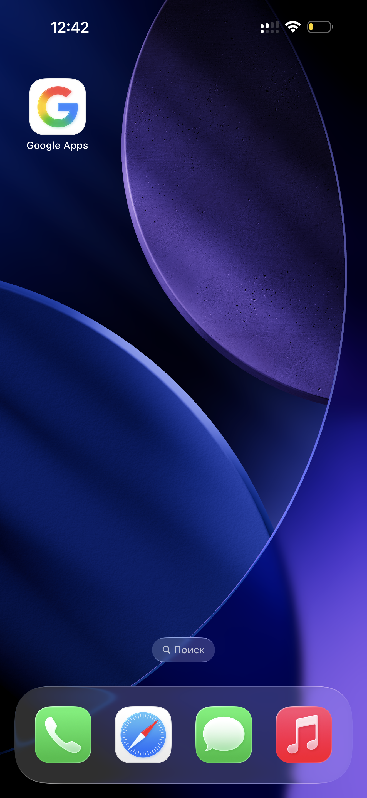
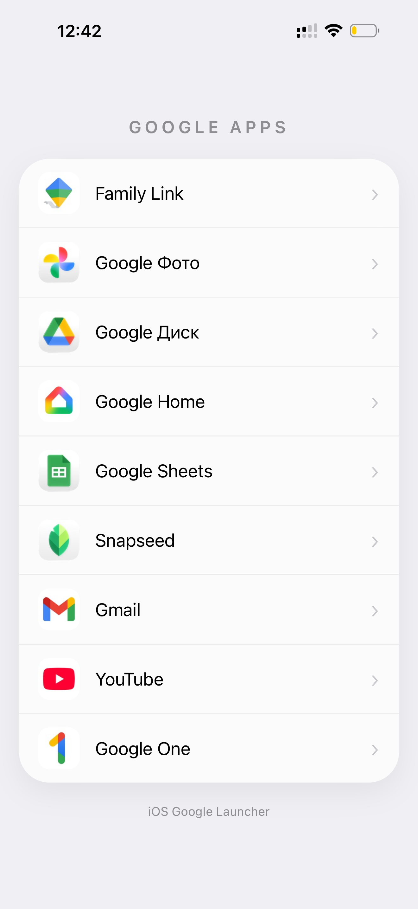
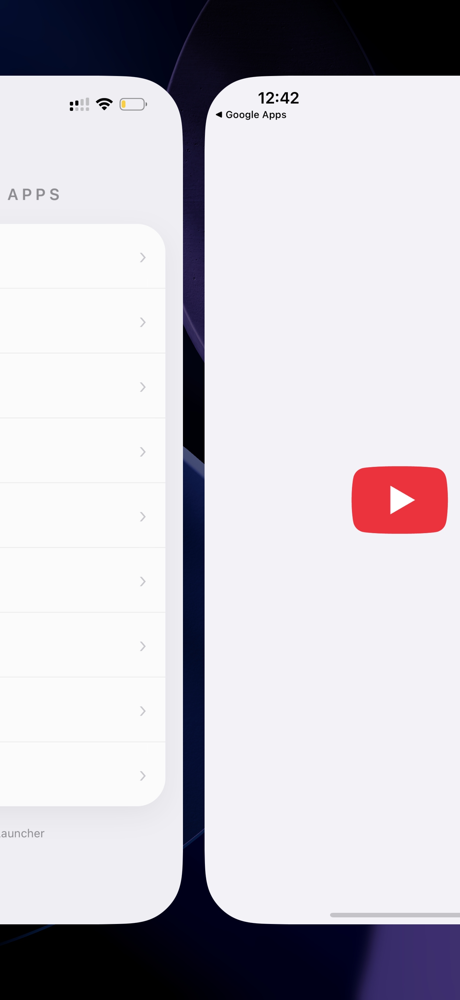

# google-menu
# 📱 Красивая папка Google для экрана «Домой» (iOS)

Стильное и минималистичное веб-приложение, которое заменяет стандартные папки iOS и собирает ваши любимые сервисы Google в одном месте с красивым визуалом.

---

### 📸 Скриншоты
<!-- МЕСТО ДЛЯ ВАШИХ СКРИНШОТОВ -->
### 📸 Скриншоты интерфейса

  
  
  

---

### ✨ Особенности реализации
* **Умное открытие:** Так как не все приложения Google поддерживают прямые URL-схемы (`URL scheme`), для стабильной работы некоторых из них настроено автоматическое перенаправление через App Store. Всё открывается без сбоев!
* **PWA-формат:** Работает как полноценное веб-приложение прямо с вашего рабочего стола.

### 🚀 Как установить?

1. Перейдите по ссылке ниже.
2. Нажмите кнопку **«Поделиться»** (Share) в браузере Safari.
3. Выберите пункт **«На экран "Домой"»** (Add to Home Screen).
4. Пользуйтесь красивой и удобной папкой!

---

### 🔗 Попробовать / Ссылка на проект

<!-- ВАРИАНТ 1: Красивая HTML-кнопка (Рекомендуется) -->

